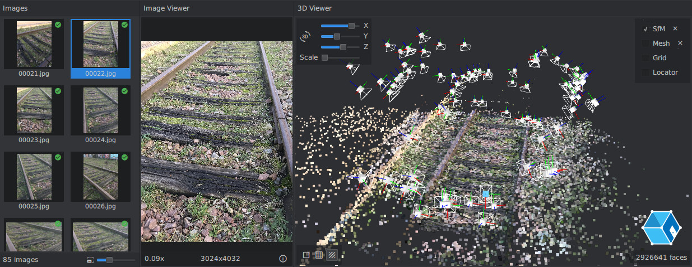

# qmlAlembic - Alembic QML plugin for Qt3D

qmlAlembic is a C++ QML plugin providing classes to load and visualize Alembic point cloud files in Qt3D.
It has been developed to load [AliceVision](https://github.com/alicevision/AliceVision) sparse reconstruction results inside [Meshroom](https://github.com/alicevision/meshroom).



For now, it only handles point clouds and cameras.

## License

The project is released under MPLv2, see [**COPYING.md**](COPYING.md).


## Get the project

Get the source code:
```bash
git clone --recursive git://github.com/alicevision/qmlAlembic
cd qmlAlembic
```
See [**INSTALL.md**](INSTALL.md) to build and install the project.


## Usage

Once built and with the plugin installation folder in `QML2_IMPORT_PATH`:

```js
import AlembicEntity 1.0

Scene3D {
  AlembicEntity {
    url: "myfile.abc"
  }
}
```
